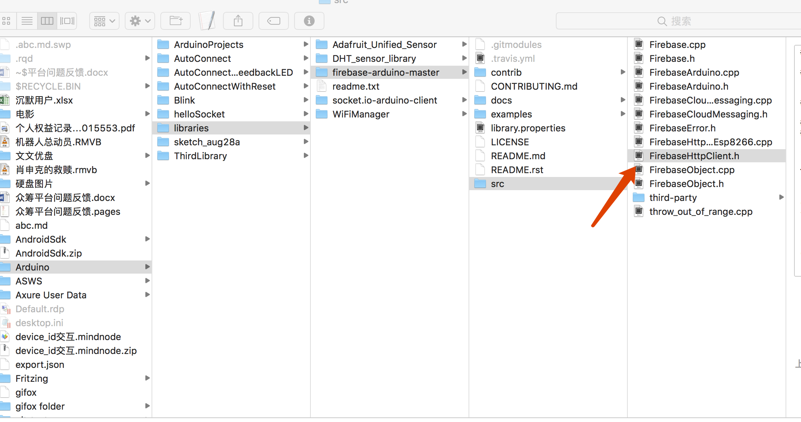
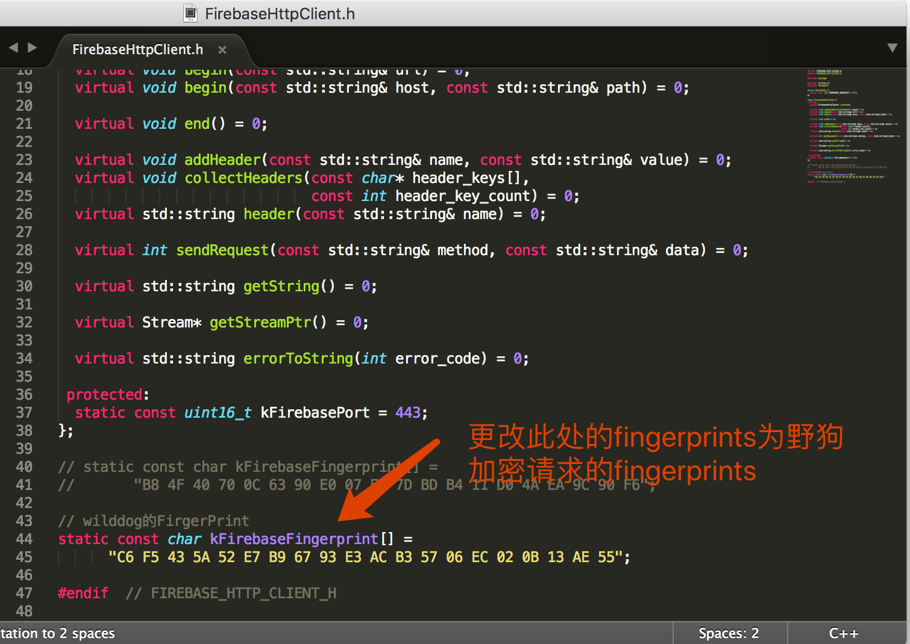
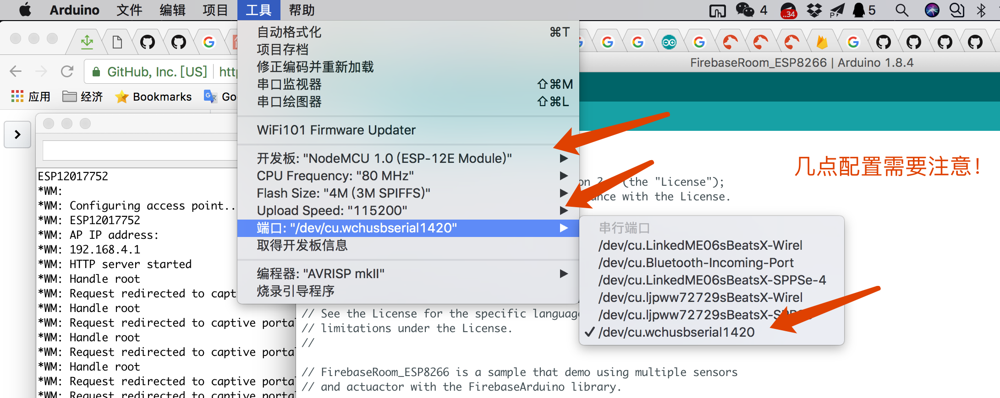

## ESPClient
该客户端采用ESP8266无线Wifi芯片，通过野狗实时通信引擎，实现智能开关控制系统，同时支持无线AP模式配置模块Wifi连接。
### 依赖的库
1. [firebase-arduino](https://github.com/firebase/firebase-arduino)具体使用了其中的**FirebaseRoom**实时通信功能，配置过程参见其**README**（需将此库改成野狗实时通信引擎，所以无需配置Firebase Project !）。
2. [WiFiManager](https://github.com/tzapu/WiFiManager)实现无线AP模式配置连接Wifi的功能。  

### 具体操作
1. 安装[Arduino](https://www.arduino.cc/en/Main/Software)
2. Install [Arduino ESP8266 core](https://github.com/esp8266/Arduino#installing-with-boards-manager)，建议Arduino版本不低于1.6.4采用Boards Manager安装。
3. 安装驱动

 * [CH340G驱动](http://www.wch.cn/download/CH341SER_MAC_ZIP.html)
 * [CP210x驱动](https://www.silabs.com/products/development-tools/software/usb-to-uart-bridge-vcp-drivers)  
4. 安装依赖库  

 * firebase-arduino  
     * 按照[Software setup](https://github.com/firebase/firebase-arduino/tree/master/examples/FirebaseRoom_ESP8266#software-setup)步骤安装firebase依赖库。  
     * 因为firebase是google旗下产品，所以在国内无法正常访问，可采用野狗实时通信引擎作为替代方案：  
            [野狗](https://www.wilddog.com)实时通信引擎可以说与firebase实时通信引擎是具有一致的功能和实现方案，所以可以替换为野狗实时通信引擎。
            将firebase-arduino替换为野狗需要更改库文件，具体位置如下：  
            
将其中的fingerprints值替换为野狗的加密协议的fingerprints值：
  

    > 附：fingerprints查询地址 [Gibson Research Corporation Fingerprints](https://www.grc.com/fingerprints.htm)    

 * WiFiManager  
 按照**README**中给出的方案按照WiFiManager。
 
5. 打开工程文件
打开从github中clone下的文件，配置端口：

6. 编译运行
配置文件中的FIREBASE_HOST（从野狗工程中复制），编译运行。
    

